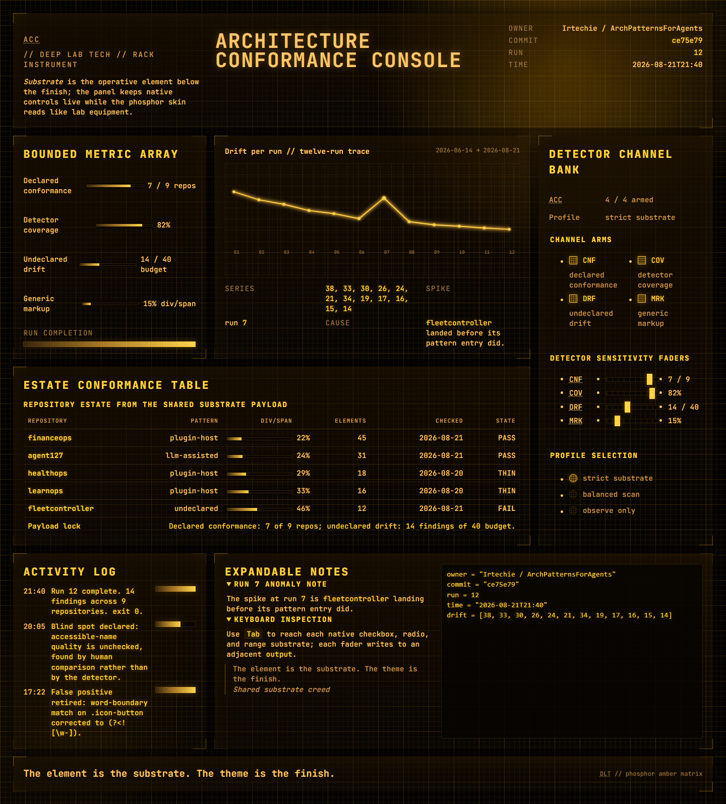
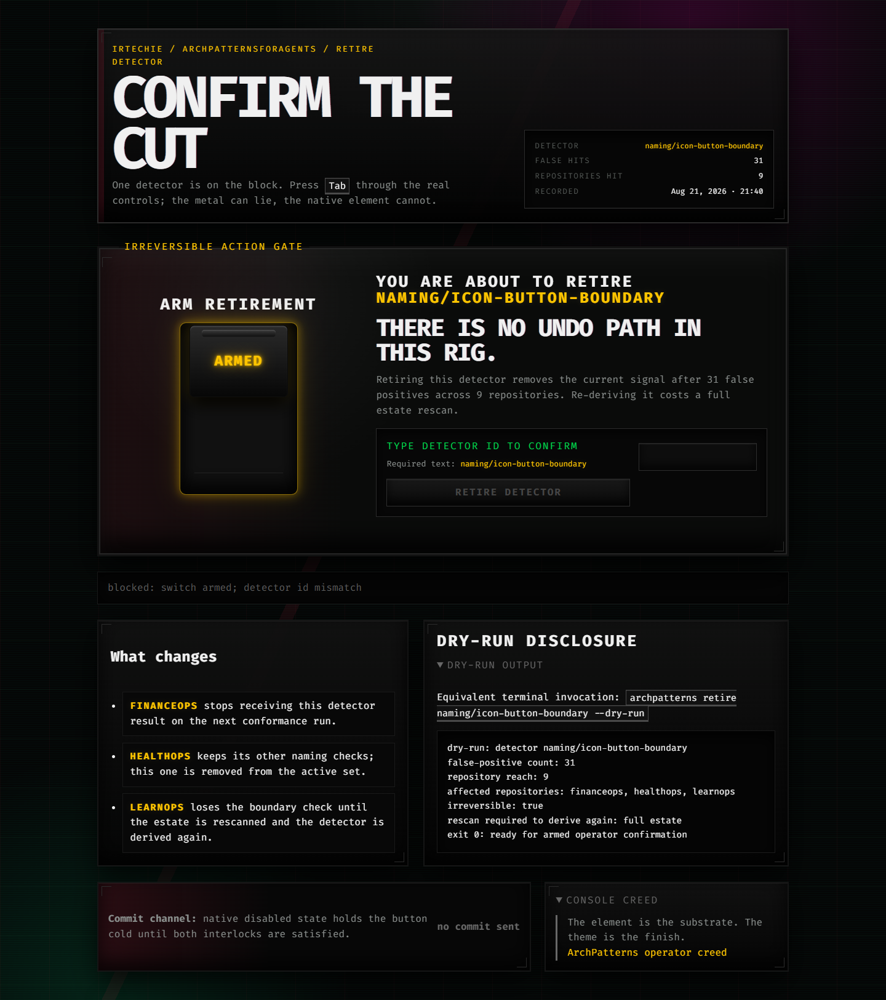
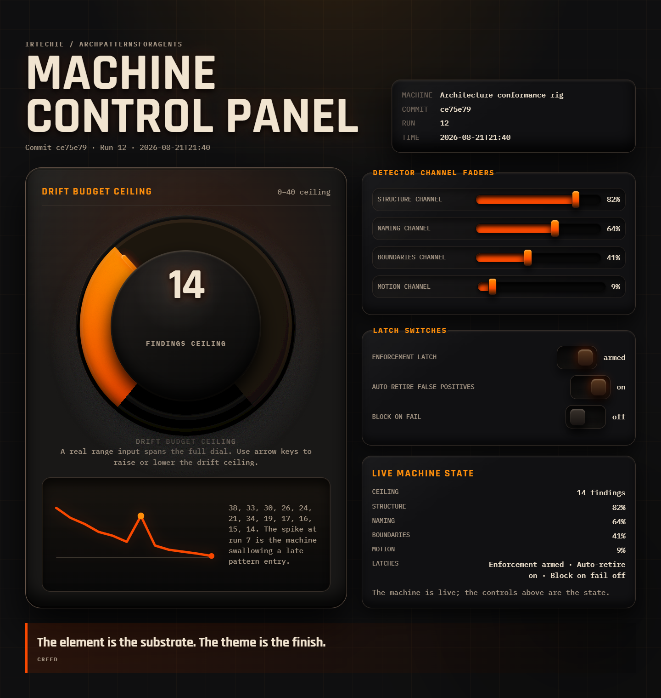
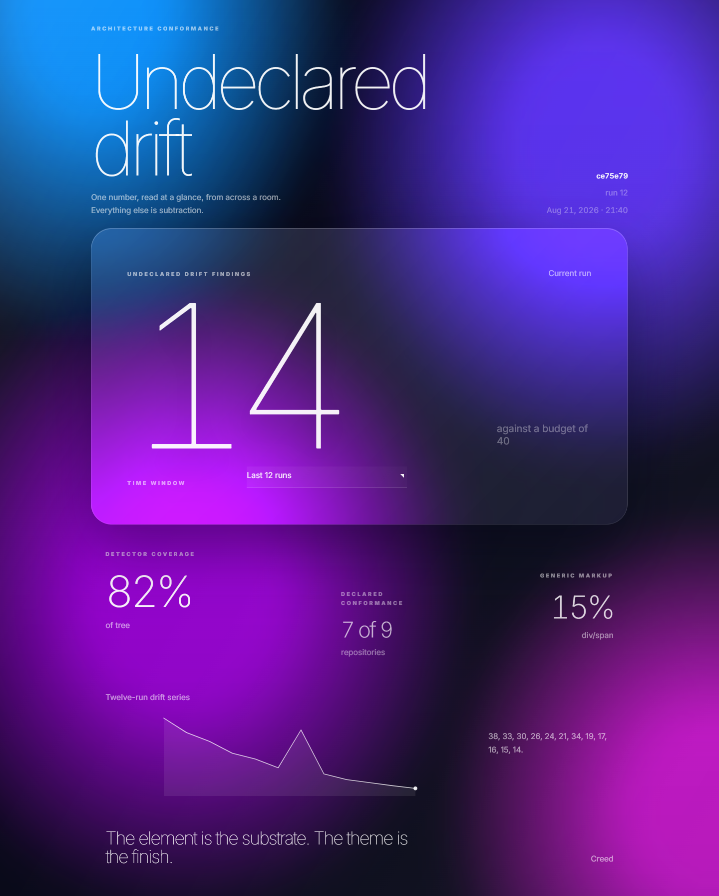

# Theme gallery

Four themes. **Four different kinds of surface** — not one console in four colours.

Pick by eye, then read that theme's `page.html`. Everything here passes five
checks with zero failures, so whichever you choose you are copying a real
substrate rather than a picture of one.

| Theme | It is for | Its hero |
|---|---|---|
| [Deep Lab Tech](#deep-lab-tech) | scanning a matrix for the outlier | a 5-column table and nine gauges |
| [Gritty Cyberpunk](#gritty-cyberpunk) | committing to something irreversible | an interlock you must arm *and* type past |
| [The Nocturnal Forge](#the-nocturnal-forge) | driving a machine in a dark room | a rotary dial you can turn with arrow keys |
| [Pristine Hyper-Minimalism](#pristine-hyper-minimalism) | one number, read from across a room | the number, enormous |

---

## Deep Lab Tech

**Genre — data explorer.** The densest page in the registry, and the only one
that leads with a table. That is correct: a comparison matrix *is* rows sharing
columns, and this is the theme built to be scanned rather than read.

It owns the entire tabular vocabulary. `table caption thead tbody tfoot colgroup
meter progress abbr dfn ol` appear on **no other theme** — eleven elements unique
to this page, which is what a genre looks like when it is real.

Phosphor amber on charcoal, corner brackets instead of boxes, millimetre-paper
ground, an inline SVG trace with a genuine `feGaussianBlur` phosphor bloom.

[`deep-lab-tech/page.html`](deep-lab-tech/page.html) · 246 elements, 49 distinct, 0% div/span



---

## Gritty Cyberpunk

**Genre — confirm and execute.** Not a dashboard. A page where you are about to
do something you cannot undo.

The whole surface is one decision: retire a detector that has thrown 31 false
positives, at the cost of a full estate rescan. The interlock is real and
double-gated — a heavy arm switch (`<input type="checkbox">`) *and* a
type-the-exact-detector-id field. The `<button>` carries the native `disabled`
attribute until both are satisfied, so the paint cannot disagree with the state.

`table`, `meter` and `progress` are **forbidden** here. A surface about an act
does not report a status.

Abyssal black, CRT scanlines, an `oklch` accent that only ignites on arming,
chromatic-aberration glitch on commit — all of it behind `prefers-reduced-motion`.

[`gritty-cyberpunk/page.html`](gritty-cyberpunk/page.html) · 73 elements, 32 distinct, 7% div/span



---

## The Nocturnal Forge

**Genre — control panel.** Every number on this page is something you can
*change*.

The dial is the registry's key proof. It looks like machined tungsten and it is
an `<input type="range" min="0" max="40">` underneath — arrow keys move it,
`:focus-visible` lights the bezel, and it announces as "Drift budget ceiling".
Four channel faders and three latch switches sit beside it, all native, all named.

No estate table: a control panel that lists rows of repository data is a
dashboard wearing a dial.

Warm tungsten on charcoal, powder-coated metal from `feTurbulence`, heavy
inset/outset shadow arrays, a `conic-gradient` track that burns orange as the
value rises. Eleven panels, no two alike.

[`nocturnal-forge/page.html`](nocturnal-forge/page.html) · 104 elements, 28 distinct, 0% div/span



---

## Pristine Hyper-Minimalism

**Genre — single metric.** One number. Everything else is subtraction.

This is the strictest theme in the registry and the shortest page: 46 elements
and 7 rich ones, against Deep Lab Tech's 246 and 24. Its forbidden list is the
longest — no `table`, `fieldset`, `meter`, `progress`, `dl`, `ol` or `details`.
A page whose job is one number does not need a gauge, a form group or a grid.

It carries exactly **one** glass pane, around the hero. That scarcity is what
makes the hero read as the hero. The three supporting figures sit unenclosed on
the mesh at three different scales — deliberately not a row of three equal boxes.

Saturated four-colour `oklch` mesh, `backdrop-filter` glass, extreme type scale,
spring-eased tilt.

[`pristine-minimalism/page.html`](pristine-minimalism/page.html) · 46 elements, 19 distinct, 0% div/span



---

## Four layers, and only one is fixed

| Layer | Varies? | Example |
|---|---|---|
| **Substrate** — the semantic element | **never** | forge's dial and lab tech's faders are both `<input type="range">` |
| **Genre** — what kind of surface, and therefore what data | yes | explorer vs decision vs control vs metric |
| **Composition** — which controls, how many, hierarchy | yes | 11 controls vs 1 |
| **Finish** — colour, texture, type, motion | yes | tungsten vs phosphor |

**Genre is the layer this registry originally got wrong**, and the mistake is
worth keeping on the record. An earlier contract froze one shared data payload so
the four previews would be comparable. Because the data shape picks the element,
that froze the elements too:

| | Before | After |
|---|---|---|
| Vocabulary common to all four themes | **57%** | **18%** |
| Elements shared by every theme | 16 | **5** — `time output blockquote cite code` |
| Rich-element counts | 14, 17, 18, 24 | **7, 9, 12, 24** |
| Distinct elements per page | 35, 41, 45, 49 | **19, 28, 32, 49** |
| Themes with no unique element | 3 of 4 | lab tech alone owns 11 |

Before, the four pages were within 1.4x of each other on every structural
measure — four consoles of near-identical build. After, the spread is 2.6x,
because a page whose job is one number is now *allowed to be small*.

Four monitoring consoles in four paint jobs is not four themes. The five
still-shared elements are the ones that genuinely belong anywhere: a timestamp, a
live value, a quotation, an identifier.

## Escaping card soup twice

The registry's first failure was card soup — themed components measuring 83–95%
`div`/`span`. Fixing the markup produced a *second* monoculture: every page
carrying one of every rich element, because a threshold ("8 or more") became a
target.

And clean markup still does not guarantee a page that doesn't *look* like cards.
The single-metric page hit 0% div/span with 19 distinct elements while rendering
three interchangeable glass boxes. `audit-visual-repetition.mjs` exists for that
gap — it measures repeated identical panels, which no markup check can see.

| Theme | Panels | Largest identical run |
|---|---|---|
| deep-lab-tech | 10 | 1 |
| gritty-cyberpunk | 15 | 2 |
| nocturnal-forge | 11 | 1 |
| pristine-minimalism | 1 | 1 |

Panels are not the defect. **Repeated identical panels are.** The forge carries
eleven and reads as designed, because no two are the same box.

## Regenerating

```bash
npm run shoot                          # all themes
node scripts/shoot-themes.mjs forge    # one theme
npm test                               # all five gates
```

Uses whatever Chrome or Edge is installed; downloads no browser.

## Adding a theme

1. Choose a **genre no existing theme covers.** Two themes with the same genre
   are one theme in two colours. Add `genre`, `premise`, `leads_with` and
   `forbidden` to `index.json` — `forbidden` is the load-bearing field.
2. Write `themes/<id>/page.html` against
   [`_shared/substrate-contract.md`](_shared/substrate-contract.md).
3. `npm test` must exit 0. That includes two registry-wide checks which grade
   your theme against the others — a page cannot pass them alone.
4. `node scripts/shoot-themes.mjs <id>`, then add a section here.

A theme with no image is not choosable, so `--verify` treats a missing preview as
a failure.
